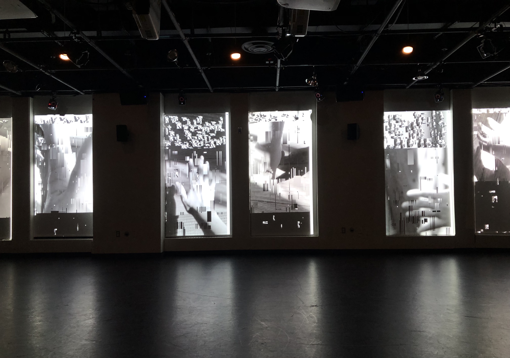

### Assignment 1 for CPSC 334: Creative Embedded Systems ###

Video Link: https://vimeo.com/611315005

### Instructions: ### 
This work was designed to be shown with 6 projectors in the Leeds Studio space, as mapped out in this diagram: https://github.com/risxyang/CPSC-334-A1G/blob/main/Visual%20Mapping%20Documentation.pdf 

Download the entire "proj-folder" / clone it to the Leeds studio desktop and open the .pde file inside in Processing. Running this program will spawn 6 windows which are already mapped to the 6 panels in the studio projection space; no manual adjustments are necessary for this particular arrangement of projectors. 

This program relies on images in the data folder of the project directory, so ensure those are intact when you make a local copy of this repo. 

If you would like to run this on your own display, makes sure that processing (https://processing.org/) is installed on your machine. The program will automatically spawn 6 windows at regular horizontal intervals; you can avoid instantiating some number of  child windows according to your number of displays, and you can specify a different set of dimensions for each window.
